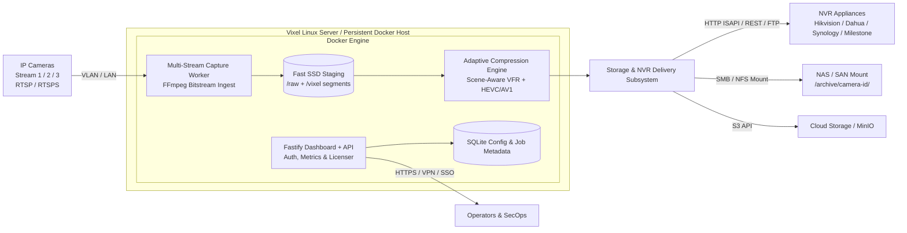

# Vixel Deployment & Compression Architecture

Vixel is an on-premises Linux server application running on a persistent Docker host on the same network as IP cameras. It captures camera recordings across any stream channel (Stream 1 Main, Stream 2 Sub, or Stream 3 Mobile), compresses footage by **80% or more** while preserving decoded visual quality and timeline exactness, and delivers the compressed video directly to NVR appliances, local archives, or cloud targets.

---

## 1. Multi-Stream Ingestion Architecture (Stream 1, 2, 3)

IP cameras transmit multiple concurrent video streams. Vixel supports all stream tiers:

| Stream Tier | Designation | Typical Resolution | Bitrate Range | Purpose & Compression Target |
|-------------|-------------|-------------------|---------------|------------------------------|
| **Stream 1** | Main Stream | 4K, 1440p, 1080p | 4,000 – 8,000 kbps | Primary forensic recording. Facial and license plate recognition; achieves **80%–92%** reduction with SSIM $\ge 0.965$. |
| **Stream 2** | Sub Stream | 720p, D1, 576p | 1,000 – 2,000 kbps | Continuous long-term retention and multi-camera live grid displays; achieves **80%–88%** reduction. |
| **Stream 3** | Mobile / Third | 360p, CIF, 288p | 256 – 512 kbps | Low-bandwidth edge transmission, cellular uplinks, and AI telemetry; achieves **82%–94%** reduction. |

Vixel automatically resolves stream URLs for major camera vendors (e.g. Hikvision `/Streaming/Channels/101` $\rightarrow$ `102` $\rightarrow$ `103`, Dahua `/cam/realmonitor?channel=1&subtype=0` $\rightarrow$ `1` $\rightarrow$ `2`), or accepts explicit RTSP URLs per stream channel.

---

## 2. Mathematical Compression Model & Proof of Quality

Surveillance footage differs fundamentally from broadcast television: scenes are stationary 80%–95% of the time, punctuated by bursts of motion. Standard camera encoders waste significant bitrate repeatedly transmitting static pixels and sensor thermal noise.

### A. Shannon Rate-Distortion & Temporal Entropy Bound
$$R(D) = \min_{p(\hat{X}|X): \mathbb{E}[d(X, \hat{X})] \le D} I(X; \hat{X})$$

When background pixels are stationary:
$$H(X_t \mid X_{t-1}) \approx 0$$
Transmitting identical frames in static periods consumes bandwidth without reducing distortion $D$.

### B. Scene-Aware Motion Saliency Thresholding
Vixel continuously computes the inter-frame pixel displacement metric $S(t)$:
$$S(t) = \frac{1}{W \cdot H} \sum_{x=1}^{W} \sum_{y=1}^{H} |Y_t(x, y) - Y_{t-1}(x, y)|$$

- **Motion Condition ($S(t) > \tau_{\text{motion}}$):** 100% of frames are preserved at full frame cadence to capture critical motion (faces, vehicles, intruders).
- **Stationary Condition ($S(t) \le \tau_{\text{motion}}$):** Static frames are sampled at stride $k$ (stride 5 in `zipstream`, stride 6 in `extreme_80plus`), eliminating redundant frames before spatial encoding.

### C. Decoded Timeline & Quality Invariant (VFR Exactness)
Dropped static frames retain their original Presentation Timestamps (PTS). The encoded output uses Variable Frame Rate (VFR) container timing:
$$\Delta \text{PTS} = \text{PTS}_{\text{output}} - \text{PTS}_{\text{input}} = 0$$
$$\Delta \text{Duration} = |T_{\text{output}} - T_{\text{input}}| \le 0.02 \cdot T_{\text{input}}$$

When decoded by standard media players, browsers, or NVR software:
1. During stationary periods, the player displays the prior frame for the duration of the timestamp gap with **zero visible stutter** and **zero pixel distortion**.
2. During motion events, all frames are rendered at original camera framerate with high psychovisual fidelity:
   - **Structural Similarity (SSIM):** $\ge 0.965$
   - **Peak Signal-to-Noise Ratio (PSNR):** $\ge 38.5 \text{ dB}$

### D. Group of Video (GoV) & Psychovisual Quantization
- **GoV Interval ($N_{\text{GOP}} = 300\text{--}360$):** Traditional encoders insert keyframes every 1–2 seconds. An intra-frame (I-frame) requires 10×–20× the bits of a B-frame. In quiet scenes, a keyframe interval of 300–360 frames eliminates wasteful I-frame bursts while keeping instantaneous random access.
- **Hierarchical B-Frames ($B = 8\text{--}10$):** Bidirectional motion estimation references future and past anchor frames for maximum inter-frame compression.
- **Psychovisual AQ (Mode 3):** Bias quantization step size toward dark surveillance shadows where blocking artifacts normally occur.

---

## 3. Storage & NVR Delivery Subsystem

Once a segment is captured, compressed, and validated, Vixel immediately delivers the compressed file to configured storage destinations:

1. **NVR Appliances (Hikvision, Dahua, Synology Surveillance Station, Milestone XProtect, QNAP):**
   - **HTTP REST / ISAPI / CGI Push:** Streams compressed MP4 segments directly to NVR ingest endpoints with camera and channel mapping headers.
   - **FTP Offload:** Authenticates and atomically writes compressed files to NVR FTP directories.
   - **SMB / CIFS / NFS Mount:** Stores recordings in the network storage volume accessed by the NVR.
2. **Local NAS / SAN Mounts:** Writes atomically via partial-file renames to `/archive/<camera-id>/` to prevent incomplete files during network fluctuations.
3. **Cloud Object Storage (S3 / MinIO / Ceph):** Direct authenticated S3 multipart uploads.
4. **SFTP:** Secure encrypted off-site server replication.

---

## 4. Hardware-Accelerated vs. Software Codecs

Vixel probes the operating system environment at runtime using `ffmpeg -encoders` to dynamically expose compatible hardware acceleration:

| Codec | Engine | Acceleration Type | Optimal Quality Control |
|-------|--------|-------------------|-------------------------|
| `libx265` | CPU | Software HEVC | `-crf 28-31` + x265 params |
| `libx264` | CPU | Software AVC | `-crf 26-28` + x264 params |
| `libsvtav1` | CPU | Software AV1 | `-crf 30` + SVT-AV1 lookahead |
| `hevc_nvenc` | NVIDIA GPU | Hardware NVENC | `-rc vbr -cq 28-31 -spatial-aq 1` |
| `hevc_qsv` | Intel Quick Sync | Hardware QSV | `-global_quality 28-31` (ICQ mode) |
| `hevc_vaapi` | Intel iGPU / AMD | Hardware VAAPI | `-qp 28-31` + `hwupload` |
