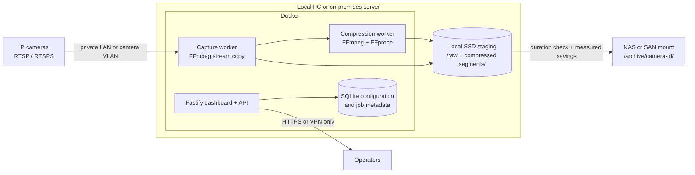

# Vixel deployment architecture

Vixel runs on a persistent Docker host on the same private network as the IP cameras. It is not a serverless workload.

## Recording path

1. The capture worker writes an RTSP segment to local staging storage.
2. The compression worker encodes a VFR MP4 and validates that its duration matches the source segment.
3. The upload step records measured input/output sizes, then copies the validated MP4 to every enabled target.
4. The local target writes to `/archive/<camera-id>/`. Docker bind-mounts `/archive` from `VIXEL_ARCHIVE_HOST_PATH` on the host.

Keep staging on a local SSD. Do not capture or transcode directly on NAS/SAN storage: a storage outage or network latency should not interrupt FFmpeg.

## NAS and SAN

Mount the storage on the Docker host first, then expose the mount to the container.

- **NAS:** mount SMB/NFS on the host and set `VIXEL_ARCHIVE_HOST_PATH` to that mounted directory.
- **SAN:** present it to the host as a block device, format/mount it, then use that mount as `VIXEL_ARCHIVE_HOST_PATH`.
- **S3/MinIO or SFTP:** configure those targets in Vixel instead of mounting them.

For Windows Docker Desktop, use a local directory that is backed by a host-mounted SMB share. Confirm Docker Desktop can access the directory before enabling cameras.

## Capacity and safety

- Reserve local staging capacity for at least two segments per concurrently active camera.
- Start with one concurrent compression job per available CPU core; H.265 and AV1 are CPU intensive.
- Treat 80% as a measured goal for static scenes, not a guarantee. Motion-heavy or already-efficient streams will save less.
- Keep RTSP inside the private network. Publish the dashboard only through a VPN or authenticated reverse proxy.
- Back up `/data` (SQLite configuration) separately from `/archive` (recordings).
