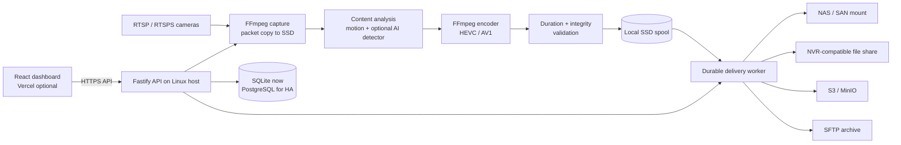

# Vixel production architecture

Vixel is an **edge recording and compression system**. The Linux/Docker host
must be on, or routed to, the IP-camera network. Vercel is optional and serves
only the web dashboard; it never stores footage or runs FFmpeg.



## Compression model and honest target

For a same-duration capture window, measured storage savings are:

```text
savings = 1 - (compressed_bytes / source_bytes)
savings_percent = 100 × savings
```

The optimization problem is not “make every file 80% smaller.” It is:

```text
minimize      compressed_bytes
subject to    |duration_out - duration_in| <= tolerance
              quality(out, source) >= camera policy
              motion / evidence cadence >= camera policy
              every configured target confirms delivery
```

An 80% reduction is realistic on high-bitrate, static or low-motion scenes;
it is not possible to guarantee it for busy scenes or already-efficient H.265
camera streams without sacrificing evidence quality. Vixel records the actual
ratio for every segment and must not advertise an estimate as a result.

## CPU-first baseline (implemented)

1. Capture the camera bitstream into an SSD-backed MKV segment. This is the
   same-window baseline used for the saving calculation.
2. Apply denoising, scene-change-aware static-frame sampling and duplicate-frame
   removal only in profiles where reduced cadence is permitted.
3. Encode with H.265 I/P/B prediction, long GoV, look-ahead and adaptive
   quantization. Preserve input PTS and produce VFR output.
4. Reject output whose duration materially differs from the source.
5. Deliver the validated output atomically to NAS/SAN/SFTP or as a streamed S3
   object. A target failure leaves the segment in local staging and records
   `upload_failed`; it is never reported as fully delivered.

Keep two or more segment windows per active camera on local SSD. Do not capture
or encode directly on a NAS/SAN mount.

## AI-assisted policy (next production increment)

AI should make *retention decisions*, not replace the video codec. The safe
pattern is an optional local inference worker that reads a low-resolution
substream and emits time-bounded evidence events:

```text
event = { camera_id, start_ts, end_ts, labels, confidence, ROI }
```

Use person/vehicle detection and tracking to select a profile per segment:

| Evidence state | Encoder policy |
|---|---|
| Person/vehicle or configured ROI active | Forensic or balanced; preserve cadence |
| No detections and low motion | Zipstream; static-frame sampling allowed |
| Detector unavailable or uncertain | Fail safe to balanced; never increase compression |

For NVIDIA hosts, a separate DeepStream/TensorRT worker is the reliable
multi-camera GPU option. For CPU-only hosts, use an ONNX Runtime worker on a
low-resolution secondary RTSP stream. Run inference in a separate process or
container so an unavailable model never stops recording. Model versions,
thresholds, events and false-positive rates belong in the metadata database.

Do **not** claim that a generic neural model by itself provides 80% compression:
the size reduction comes from temporal redundancy, rate control and the codec.
AI protects important motion from aggressive sampling.

## Delivery and retention

- Write local and SFTP targets to `*.partial-<id>` and rename only after a
  successful copy; watchers never consume a half-written recording.
- Retry transient target failures with backoff. Keep the validated spool file
  until all required targets acknowledge it.
- Treat `uploaded` as all targets succeeded. `upload_failed` requires retry or
  operator review; it is not a successful archive.
- For NVR interoperability, prefer a mounted SMB/NFS share with a stable
  camera/date path. Confirm the NVR supports indexing externally written MP4
  files; many proprietary NVRs require their own ingest API instead.
- Use PostgreSQL and a queue/outbox worker before scaling beyond one host or
  requiring high availability; SQLite is appropriate for a single appliance.

## Deployment boundary

- **Docker/Linux server:** Fastify API, SQLite/PostgreSQL, FFmpeg, AI worker,
  spool, storage connectors and camera-network access.
- **Vercel:** static React dashboard only. Set `VITE_API_BASE_URL` to the
  Linux server's private HTTPS endpoint and allow the dashboard origin in
  `VIXEL_CORS_ORIGIN`.
- **Access:** a private VPN such as Tailscale or an authenticated reverse proxy.
  Do not publish RTSP or the recorder API directly to the public internet.
